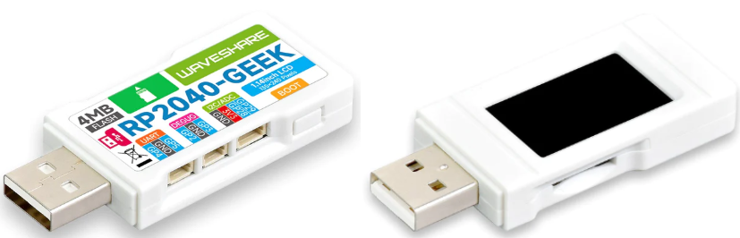

# PowerMon-Pico
Power monitoring and plotting in MicroPython using the RP2040-GEEK board from Waveshare

[RP2040-GEEK from the PiHut](https://thepihut.com/products/rp2040-geek-development-board?variant=42632478589123&currency=GBP&utm_medium=product_sync&utm_source=google&utm_content=sag_organic&utm_campaign=sag_organic&gad_source=1&gclid=CjwKCAiA3JCvBhA8EiwA4kujZp0d8ZPfaRx-Bru_PCVWu0qS4ZJszkPvd9UPkbfjliqnwS5S1JgRlxoC--wQAvD_BwE)

